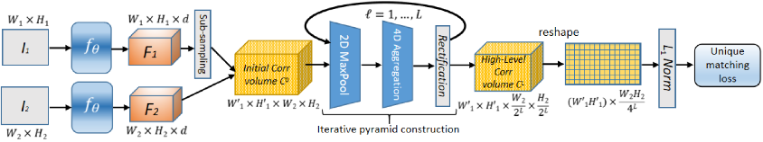

# PUMP: pyramidal and uniqueness matching priors for unsupervised learning of local features #


Official repository for the following [paper](https://openaccess.thecvf.com/content/CVPR2022/html/Revaud_PUMP_Pyramidal_and_Uniqueness_Matching_Priors_for_Unsupervised_Learning_of_CVPR_2022_paper.html):

```text
@inproceedings{cvpr22_pump,
  author    = {Jerome Revaud, Vincent Leroy, Philippe Weinzaepfel, Boris Chidlovskii},
  title     = {PUMP: pyramidal and uniqueness matching priors for unsupervised learning of local features},
  booktitle = {CVPR},
  year      = {2022},
}
```


License
-------
Our code is released under the CC BY-NC-SA 4.0 License (see [LICENSE](LICENSE) for more details), available only for non-commercial use.


Requirements
------------
  - Python 3.8+ equipped with standard scientific packages and PyTorch / TorchVision:
    ```
    tqdm >= 4
    PIL >= 8.1.1
    numpy >= 1.19
    scipy >= 1.6
    torch >= 1.10.0
    torchvision >= 0.9.0
    matplotlib >= 3.3.4
    ```
 - the CUDA tool kit, to compile custom CUDA kernels
    ```bash
    cd core/cuda_deepm/
    python setup.py install
    ```

Online Demo
-----------
You can try the [online demo](https://huggingface.co/spaces/naver/PUMP) hosted at [Hugging Face](https://huggingface.co/).
**WARNING**: this online demo runs on CPU at low image resolution (no multi-scale, no rotation), due to limited memory and computational resources. 

Warping Demo
------------

```bash
python demo_warping.py
```

You should see the following result:


Test usage
----------

We provide 4 variations of the pairwise matching code, named `test_xxxscale_yyy.py`:
 - xxx: `single`-scale or `multi`-scale. 
        Single-scale can cope with 0.75~1.33x scale difference at most.
        Multi-scale version can also be rotation invariant if asked.
 - yyy: recursive or not. Recursive is slower but provide denser/better outputs.

For most cases, you want to use `test_multiscale.py`:
```bash
python test_multiscale.py 
    --img1 path/to/img1
    --img2 path/to/img2
    --resize 600 # important, see below
    --post-filter 
    --output path/to/correspondences.npy
```

It outputs a numpy binary file with the field `file_data['corres']` containing a list of correspondences.
The row format is `[x1, y1, x2, y2, score, scale_rot_code]`. 
Use `core.functional.decode_scale_rot(code) --> (scale, angle_in_degrees)` to decode the `scale_rot_code`.


#### Optional parameters:

  - **Prior image resize**: `--resize SIZE`

    This is a very important parameter. In general, the bigger, the better (and slower).
    Be wary that the memory footprint explodes with the image size. 
    Here is the table of maximum `--resize` values depending on the image aspect-ratio:

    | Aspect-ratio | Example img sizes  | GPU memory | resize |
    |--------------|--------------------|------------|--------|
    |  4/3         | 800x600, 1024x768  |   16 Go    |  600   |
    |  4/3         | 800x600, 1024x768  |   22 Go    |  680   |
    |  4/3         | 800x600, 1024x768  |   32 Go    |  760   |
    |  1/1         | 1024x1024          |   16 Go    |  540   |
    |  1/1         | 1024x1024          |   22 Go    |  600   |
    |  1/1         | 1024x1024          |   32 Go    |  660   |

    (Formula: `memory_in_bytes = (W1*H1*W2*H2)*1.333*2/16`)

  - **Base descriptor**: `--desc {PUMP, PUMP-stytrf}`

    We provide the `PUMP` descriptor from our paper, as well as `PUMP-stytrf` (with additional style-transfer training).
    Defaults to `PUMP-stytrf`.

  - **Scale**: `--max-scale SCALE`

    By default, this value is set to 4, meaning that PUMP is _at least_ invariant to a 4x zoom-in or 
    zoom-out. In practically all cases, this is more than enough. You may reduce this value if you know
    this is too much in order to accelerate computations.

  - **Rotation**: `--max-rot DEGREES`

    By default, PUMP is not rotation-invariant. To enforce rotation invariance, you need to specify
    the amount of rotation it can tolerate. The more, the slower. Maximum value is 180. 
    If you know that images are not vertically oriented, you can just use 90 degrees.

  - **post-filter**: `--post-filter "option1=val1,option2=val2,..."`

    When activated, post-filtering remove spurious correspondences based on their local consistency. 
    See `python post_filter.py --help` for details about the possible options.
    It is geometry-agnostic and naturally supports dynamic scenes.
    If you want to output _pixel-dense_ correspondences (a.k.a _optical flow_), you need to post-process 
    the correspondences with `--post-filter densify=True`. See `demo_warping.py` for an example.


#### Visualization of results: 
```bash
python -m tools.viz --img1 path/to/img1 --img2 path/to/img2 --corres path/to/correspondences.npy
```

Reproducing results on the ETH-3D dataset
-----------------------------------------

1. Download the ETH-3D dataset from [their website](https://www.eth3d.net/datasets) and extract it in `datasets/eth3d/`

2. Run the code `python run_ETH3D.py`. You should get results slightly better than reported in the paper.


Training PUMP from scratch
--------------------------

1. Download the training data with 
    ```bash
    bash download_training_data.sh
    ```

   This consists of web images from [this paper](http://cmp.felk.cvut.cz/revisitop/) for the self-supervised loss (as in [R2D2](https://github.com/naver/r2d2))
   and image pairs from the [SfM120k dataset](http://cmp.felk.cvut.cz/cnnimageretrieval/) with automatically 
   extracted pixel correspondences. Note that correspondences are *not* used in the loss, since the loss is 
   unsupervised. They are only necessary so that random cropping produces pairs of crops at least partially aligned.
   Therefore, correspondences do not need to be 100% correct or even pixel-precise.

2. Run `python train.py --save-path <output_dir>/`

    Note that the training code is quite rudimentary (only supports `nn.DataParallel`, 
    no support for `DataDistributed` at the moment, and no validation phase neither).

3. Move and rename your final checkpoint to `checkpoints/NAME.pt` and test it with 
   ```bash
   python test_multiscale.py ... --desc NAME
   ```
